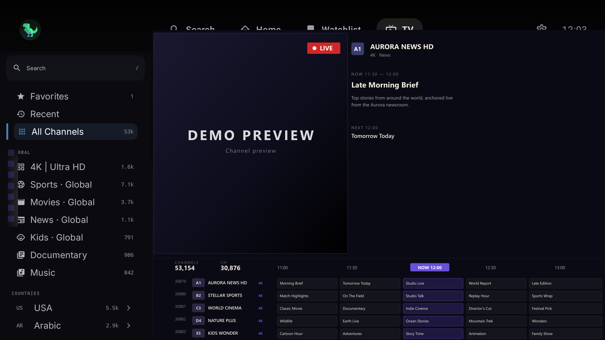
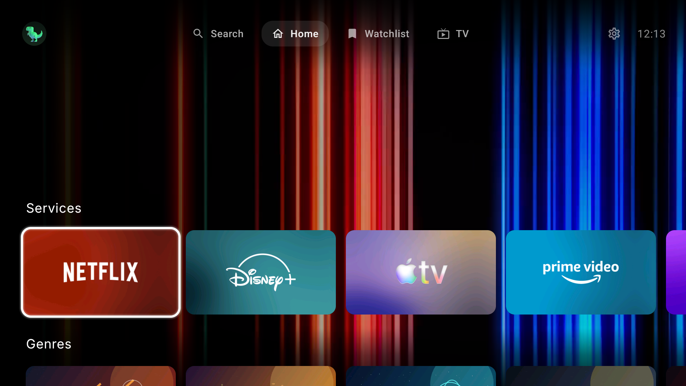
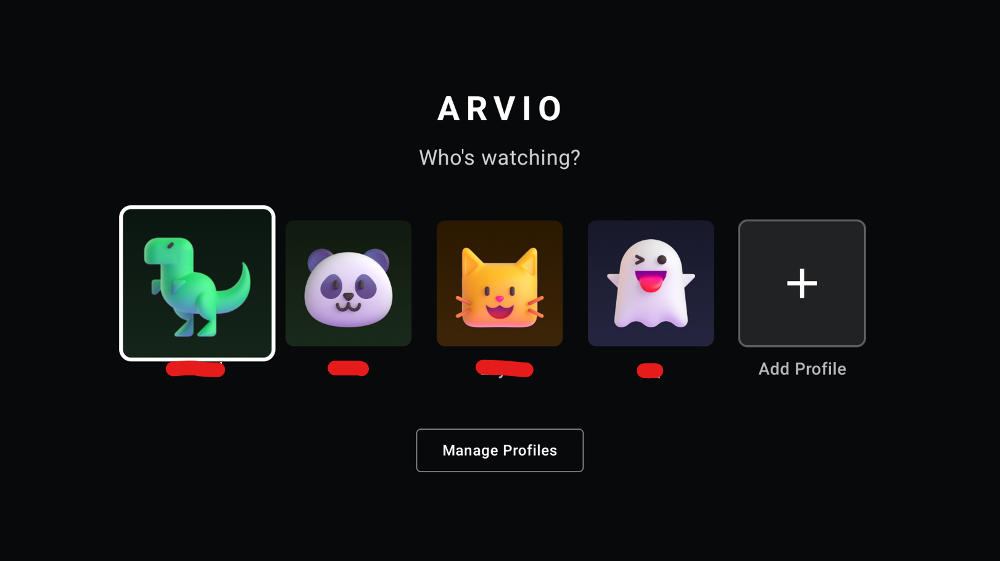

# ARVIO

ARVIO is an Android media hub for TV, phone, and tablet form factors. This repository is maintained as a source-code and development mirror for the Android application.

The app provides a media browser, player shell, profile support, optional cloud sync, IPTV playlist support, catalog configuration, and integrations with user-configured services. ARVIO does not host, store, sell, or distribute movies, series, live TV channels, playlists, streams, or other third-party media.

## Repository Purpose

This GitHub repository is for:

- Source code review and development
- Issue investigation and technical discussion
- Build documentation
- License and privacy documentation
- Contribution review

It is not intended as an advertising page, download landing page, or content distribution repository.

## Features

- Android TV, Fire TV, phone, and tablet UI
- Media browsing with TMDB metadata
- IPTV M3U/Xtream playlist support
- Optional ARVIO Cloud profile/settings sync
- Optional Trakt.tv integration per profile
- Watchlist and continue-watching state
- Subtitle and audio track selection
- User-configured addon/source support
- ExoPlayer/Media3 playback with broad codec support

## Availability

ARVIO is available on Google Play:

[](https://play.google.com/store/apps/details?id=com.arvio.tv)
## Screenshots

| Home | Details |
|------|---------|
|  |  |

| Live TV | Collections |
|---------|-------------|
|  |  |

| Mobile | Profiles |
|--------|----------|
|  |  |

## Content And Source Policy

ARVIO is a media browser and player interface for user-configured sources. It works like a media player or browser: users provide their own services, playlists, addons, and URLs.

This repository does not include hosted media content, bundled playlists, IPTV credentials, debrid accounts, third-party streaming catalogs, or links intended to enable unauthorized access to content. No movies, series, live TV channels, playlists, or other third-party media are hosted by this repository or by ARVIO.

Users are solely responsible for their usage and must comply with applicable local laws. If you believe content accessed through an external source violates copyright law, contact the actual file host, service provider, or source maintainer. The ARVIO repository and developers cannot remove content hosted by third parties.

Contributors should not submit copyrighted media, credentials, private keys, access tokens, or links intended to enable unauthorized access to content.

## Build And Run

Requirements:

- Android Studio or Android SDK command-line tools
- JDK 17
- Android SDK 35

Use the tracked Gradle wrapper:

```bash
./gradlew :app:assemblePlayDebug
./gradlew :app:assembleSideloadDebug
```

On Windows PowerShell or Command Prompt:

```powershell
.\gradlew.bat :app:assemblePlayDebug
.\gradlew.bat :app:assembleSideloadDebug
```

Install a debug build on a connected Android TV, Fire TV, emulator, phone, or tablet:

```bash
./gradlew :app:installPlayDebug
./gradlew :app:installSideloadDebug
```

For network ADB devices:

```bash
adb connect <device-ip>:5555
adb install -r app/build/outputs/apk/sideload/debug/app-sideload-debug.apk
```

Build variants:

- `play`: Play Store build, self-update and CloudStream runtime disabled.
- `sideload`: Direct APK build, self-update and CloudStream runtime enabled.
- `debug`: development build.
- `staging`: release-like build signed with the debug keystore for upgrade testing.
- `release`: production build. Use a private release keystore for distribution.

## Local Configuration

Cloud sync, Google sign-in, and Supabase-backed auth require local secrets. Copy the defaults file and fill in real values:

```bash
cp secrets.defaults.properties secrets.properties
```

`secrets.properties` is ignored and must not be committed.

For signed release builds, copy the keystore template and fill in local signing values:

```bash
cp keystore.properties.template keystore.properties
```

`keystore.properties` and keystore files are ignored and must stay private.

## Release Checks

Before publishing a build, run:

```bash
./gradlew :app:compilePlayDebugKotlin
./gradlew :app:assemblePlayRelease
./gradlew :app:assembleSideloadRelease
```

Smoke-test startup, profile switching, playback, stream fallback, subtitle/audio switching, IPTV/EPG loading, addon add/remove, search, settings navigation, background sync, and repeated player open/close on the supported device classes.

## Star History

<a href="https://www.star-history.com/?repos=ProdigyV21%2FARVIO&type=date&legend=top-left">
 <picture>
	 <source media="(prefers-color-scheme: dark)" srcset="https://api.star-history.com/chart?repos=ProdigyV21/ARVIO&type=date&theme=dark&legend=top-left" />
	 <source media="(prefers-color-scheme: light)" srcset="https://api.star-history.com/chart?repos=ProdigyV21/ARVIO&type=date&legend=top-left" />
	 
 </picture>
</a>

## Privacy

See [PRIVACY.md](PRIVACY.md) for the privacy policy.

## License

This project is licensed under the Apache License 2.0. See [LICENSE](LICENSE) for details.

## AI Disclosure

This application was developed with significant AI assistance. Contributions should still be reviewed, tested, and treated as normal source code changes.

If you have concerns about using AI-generated software, please do not use this application.
