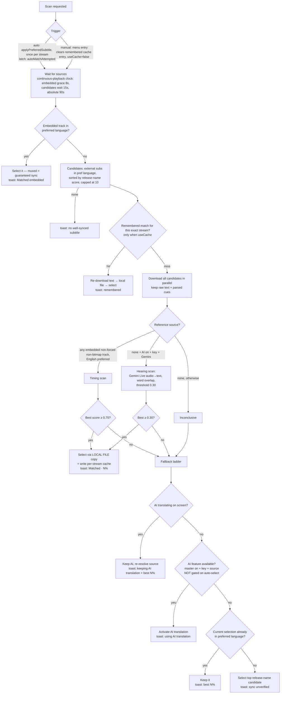

# Subtitle Auto-Match ("Find Best Match") — Design & Behavior Reference

Complete reference for the subtitle auto-matching feature and its interaction with AI subtitle
translation. Written to be self-contained: hand this file to a fresh session/developer for full
context.

**Code map**

| Concern | File |
|---|---|
| Scan orchestration, selection flows, caches, settings gating | `app/src/main/kotlin/com/arflix/tv/ui/screens/player/PlayerViewModel.kt` (`findBestSubtitleMatch`, `runFindBestMatch`, `activateAiSubtitle`, `applyPreferredSubtitle`, `MATCH_*` constants) |
| Cue download/parse + timing/word scoring | `.../player/SubtitleSyncMatcher.kt` |
| Subtitle menu, selection application, media item rebuild, startup watchdog | `.../player/PlayerScreen.kt` |
| AI batch translation (Groq/Gemini generateContent) | `.../player/SubtitleTranslationManager.kt`, `SubtitleTranslationService.kt` |
| Live hearing (Gemini Live WS, audio → target-language text) | `.../player/GeminiLiveTranslationService.kt`, `AudioCaptureProcessor.kt` |
| Renderer hooks (buffered-cue reflection, pre-translation, cue offset) | `.../player/AiSubtitleRenderersFactory.kt` |
| Settings UI (toggle lives in **Subtitles** section, not AI) | `.../settings/SettingsScreen.kt` (TV row id **38**), `SettingsViewModel.kt` |
| Cloud backup/restore of settings | `.../data/repository/CloudSyncRepository.kt` |

---

## 1. Settings and what they control

| Setting | DataStore key | Default | Controls |
|---|---|---|---|
| Preferred subtitle language | `default_subtitle` (profile-scoped) | — | The **target language** of matching and AI translation (`targetSubtitleLangCode`, `matchLanguageName`). |
| Auto Find Best Subtitle Match | `subtitle_ai_find_best_match` | `false` | Auto-runs the scan on playback. **AI-independent** (works with no API key). Off by default — users opt in. Key name kept for backward compat. |
| AI subtitle translation (master) | `subtitle_ai_enabled` | `false` | Enables AI features: translation option in menu, AI interim during scans, hearing fallback. |
| Auto-Select AI Translation | `subtitle_ai_auto_select` | `false` | Allows AI translation to activate **automatically** (incl. as the scan's on-screen interim). |
| Model | `subtitle_ai_model` | `GROQ_LLAMA_70B` | Groq or Gemini for batch translation. **Hearing requires Gemini.** |
| API key | `subtitle_ai_api_key` (global) | — | One key used for both batch translation and Gemini Live. |

All of the above (except profile-scoped language) sync via `CloudSyncRepository`
(`subtitleAiFindBestMatch` field in the backup JSON).

### Behavior matrix (all combinations)

| AI master | Auto-select AI | Find-match | On playback |
|---|---|---|---|
| any | any | **off** | Classic flow only: best release-name-scored sub in preferred language. Manual "Find Best Match" menu entry still available. |
| off | — | on | Classic pick shows immediately → **silent background scan** (subtitles hidden during it) → verified match replaces pick, else pick stays. Zero AI/API usage. |
| on | off | on | Same silent scan (user opted out of auto-AI). AI translate remains a manual menu option. |
| on | on | off | AI translation activates directly (no scan). |
| on | on | on | Scan with **AI translation as on-screen interim**; if no match, AI stays (source re-resolved to prefer embedded). |

Menu entries (player → subtitle menu, inside the preferred-language group):
- **"Find Best Match"** (badge `Auto`) — always present when a preferred language is set (`matchLanguageName`), AI-independent.
- **"<Language>" AI translate** (badge `AI`) — only when AI available (`isAiAvailable`).
- D-pad index math: headers = `(match? 1 : 0) + (ai? 1 : 0)`, subs follow.

---

## 2. The scan pipeline

Fallback rationale: AI timing comes from the built-in track (verified), so it beats any
unverified addon pick. Auto-select only governs *unprompted* activation at playback start; a
failed scan explicitly asked for the best available subtitle. Same ladder applies when zero
target-language candidates exist.

### Timing scan (reference collection loop, 300ms ticks)

- Merge **buffered upcoming cues** (reflection into the text renderer; typically only 2–12
  visible) with **realtime rendered-cue intervals** (`onPlayerCues`), deduped by overlap.
  ⚠ media3 picks a cue resolver per the track's cue-replacement behavior. For REPLACE tracks
  (`ReplacingCuesResolver`, e.g. MKV SubRip) the `CuesWithTiming.durationUs` is **C.TIME_UNSET**
  (large negative) — each cue lasts until replaced. The interval converter must coerce
  non-positive durations to a nominal ~2s, or every item is rejected (`end < start`) and the
  buffered path silently returns 0 for that whole content category: scans crawl at realtime pace,
  and realtime windows carry a systematic ~600ms render-lag skew that suppresses well-synced subs
  to ≈ the 0.70 threshold. Realtime reference intervals ≠ authored cue times — buffered is the
  trustworthy source. (When debugging extraction, temporarily log resolver class/field/item
  counts inside `extractBufferedIntervals` — that's how both resolver bugs were found.)
- Guards on the buffered read: candidate-time-range sanity filter; **self-match guard by TEXT** —
  sample up to 8 buffered cue texts and drop the read if ≥half match the previously displayed
  candidate's own (normalized) lines. Guard history, do not regress:
  1. exact-coincidence timing (±60ms both edges) — defeated by the reflection's uniform
     stream-offset shift; a candidate scored 0.86 against itself;
  2. constant-delta timing (median ±80ms) — false-positived on subs cut from the same master
     (Hebrew vs Czech share cue timings), discarding legit references and freezing scans at
     realtime pace;
  3. **text comparison (current)** — language-discriminating, immune to both failure modes.
  The track switch to the reference also propagates asynchronously: ~1.5s settle delay, target
  indices re-resolved from current state, and the embedded override retries up to 10s with fresh
  indices (one-shot appliers are fragile after MediaItem rebuilds), disabling text while invalid
  instead of falling back to preferred-language (which silently kept the displayed sub rendering).
- Realtime intervals: capped at 20s each (longer = seek artifact), reset on backward seek.

**Exit conditions** (first hit wins):

| Condition | Values |
|---|---|
| Target reached | ≥ 8 intervals AND span ≥ 30s |
| Early accept | ≥ 4 intervals, span ≥ 30s, some candidate ≥ 0.8 |
| Fast accept | ≥ 5 intervals, span ≥ 15s, some candidate ≥ 0.85 |
| Give-up (no speech yet) | 4 min |
| Give-up (stagnation) | 90s since last new interval (clock **frozen while paused**) |
| Absolute ceiling | 10 min |

Post-loop: `< 2` intervals or span `< 15s` ⇒ inconclusive (fall to ladder).

### Scoring (`SubtitleSyncMatcher.scoreByTiming`) — HYBRID, calibrated

Per reference window, averaged:
- Window ≤ 7s (a real cue): **best single-cue overlap** — this discriminates offsets; union
  coverage here scored *everything* 0.9+ in dense dialogue (offset subs have cue chains touching
  any short window).
- Window > 7s (realtime merges back-to-back cues): **union-of-cues coverage** — a synced sub
  needs several cues to span it; single-cue unfairly caps at ~0.3.

Calibration (user-verified, July 2026): synced subs score 0.71–0.98; a confirmed-offset sub
scored 0.65. Accept threshold **0.70** (timing) / **0.30** (hearing). The good/bad boundary is
narrow — do not nudge thresholds or the metric without fresh A/B evidence.

---

## 3. Selection & the local-file trick

Selecting an **external** subtitle rebuilds the MediaItem (re-prepare). Economics:
- Video re-open: debrid streams are deliberately **not disk-cached** (I/O bottleneck) — usually
  fine, occasionally slow/stale.
- Subtitle download during rebuild was the common stall (slow addon proxies) ⇒ matched subs are
  served from a **local cache file** (`cacheDir/matched_subs/`, ≤40 files):
  the scan already downloaded the text; `localizeSubtitle()` writes UTF-8 (gunzipped) and selects
  a `file://` copy (same id). The data source chain wraps OkHttp in `DefaultDataSource` for
  file support. The tracks-changed remap keeps `file:` selections as-is (would otherwise swap
  back to the remote URL and re-trigger a rebuild).
- **Do NOT preload all subs into the MediaItem** — tried historically and reverted: ExoPlayer
  eagerly downloads every side-loaded config at prepare (30+ requests), plus encoding issues.

Subtitle MIME sniffing strips trailing slashes (`…/sub.vtt/?q=` is VTT — AIOStreams shape);
default is SRT for extensionless URLs.

## 4. Per-stream remembered cache

- Key = stream identity, **not** title: `infoHash:fileIdx` → `videoHash` → `filename:size` →
  URL hash. Same episode from a different source ⇒ different key ⇒ fresh scan (sync is a property
  of the file).
- Value = candidate `provider|id` (not URL — addon URLs are ephemeral). Stored as JSON list in
  `subtitle_match_cache_v1` (global DataStore), LRU 50. **Not cloud-synced** (deliberate).
- Written on verified match only (never for unverified fallback picks).
- Manual track pick in the target language **overwrites** the entry; picking anything else
  clears it. Manual "Find Best Match" click clears it and scans fresh (`useCache=false`).

## 5. State resets (bugs lived here)

- `loadMedia`: resets all selection flags, `autoMatchAttempted`, AI source, **and the subtitles
  list** — externals accumulate additively during one video; without clearing, a new video scans
  the previous title's candidates (references vs wrong-show subs ⇒ uniform ~0.1 scores while the
  correct fresh sub isn't scanned at all).
- Provided-URL loads with **no resolvable IMDb id** must still run `scheduleSubtitleSelection`
  (embedded tracks + AI exist without addon subs). The silent else-branch here was one cause of
  the "plays with subtitles Off, no scan, nothing" regression.
- The deeper cause: the subtitle fetch/selection block was the **last child coroutine of the
  load job** — an uncaught exception in ANY sibling (VOD/home-server/stream appenders) cancels
  all siblings, killing the subtitle flow before its first line. It now runs on `viewModelScope`
  directly (as `subtitleRefreshJob`, cancelled by `loadMedia`), and each sibling is
  failure-isolated with a `load child '<name>' failed` log. Rule: anything subtitle-critical
  must not share a Job with flaky background appenders.
- `selectStream` (mid-session source switch — does NOT pass through `loadMedia`): must reset
  selection flags, purge **embedded** subtitle entries (per-file!), clear selection with a nonce
  bump, cancel a running scan. Missing pieces here caused: wrong-track selection (stale indices),
  "selected but not rendering" (no nonce bump), auto-flow never re-running (stale
  `hasManualSubtitleSelection`).
- During the scan, subtitles are hidden (`subtitleView.visibility`) when
  `isFindingBestMatch && !isAiTranslating` — display-only; cue collection listens on the player.
- Startup watchdog failover must reset `streamSelectedTime` optimistically before `continue`,
  or it burns the whole source list in milliseconds (stale-clock burst).

## 6. AI specifics

- Batch translation pre-fetch (`triggerPreTranslation`/`preTranslateWindow`) is gated on
  `translationManager.isEnabled` — without this it spends API requests whenever any track renders
  (the 401-toast-with-AI-off bug).
- AI interim during scans: only when `aiSubtitleEnabled && aiSubtitleAutoSelect`. Source is
  re-resolved on every activation (embedded preferred; external only if English) — a stale
  external source caused mistimed translations.
- Hearing fallback: Gemini model + key + AI on; aborts on WS ERROR; same progress-anchored
  timers as the timing scan.
- Gemini Live target language comes from the preference (`targetLanguageCode`), default `he`.

## 7. Provider quirks (see also memory: project_aiostreams)

- **AIOStreams**: subtitles endpoint slow (8–12s) / 502s cold → subtitle fetch is parallel,
  30s timeout, one retry. Its streams are exempt from quality sorting (`keepsOwnStreamOrder`) —
  user pre-sorts server-side. Sub URLs end `…/sub.vtt/`.
- **OpenSubtitles v3+ proxy** (`opensubtitles.stremio.homes`): VTT with double `WEBVTT` header,
  a branding banner cue at 0:01–0:06, recap lines as NOTE comments. Scanner's parser is tolerant;
  keep an eye on ExoPlayer's stricter parser if display anomalies appear.

## 8. Known-good log workflow

Debug via `adb logcat` tag `SubMatch`:
- `reference source=…` — scan entered scoring (after source-wait).
- `align src=buffer|realtime|buffer+realtime buffered=N total=M refs=[…] candNear=[…]` —
  reference intervals vs the first candidate's cues nearest the scan window; `src=buffer` +
  score **exactly 1.00** = self-match red flag; `buffered=0` = extraction dead (see §2 warning).
- `[builtin] candidate … score=X` / `[hearing] candidate …` — per-candidate verdicts.
- Rare warnings that flag real faults: `realtime self-cue interval dropped` (reference track
  switch didn't land), `subtitle fetch skipped: no imdbId`, `load child '<name>' failed`,
  `hearing aborted`, `match cache write failed`.
Toast decoder: "Matched · N%" = verified; "(remembered)" = cache hit; "(sync unverified)" =
fallback pick; "No well-synced … (best N%)" = rejection with evidence.
